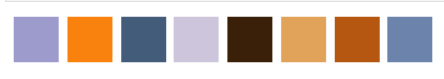

# Dominant_colors
An unsupervised learning model which extracts the dominant colours from a picture using opencv. 

## Demo 
`Input Image`   
  
`Extracted palette of 8 dominant colors`  
  
`Fraction of each dominant colors`  
  

## Application
When a image has large range of colours we can find the dominant colours and display the image only with dominant colour in image.

## Overview
Read the image using `opencv`. `Opencv` works in BGR, so convert it to RGB for `matplotlib`. Resize the image into lower dimensions and reshape it to provide input to `K means clustering`. Plot all the clusters and calculate the fraction of each cluster color in the image.
